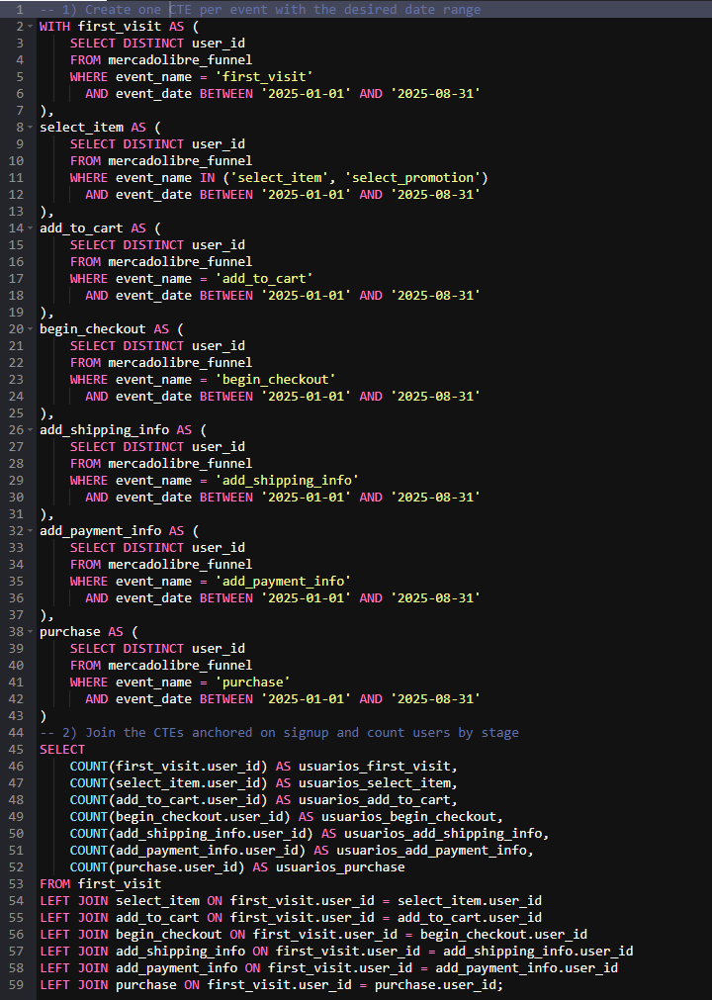
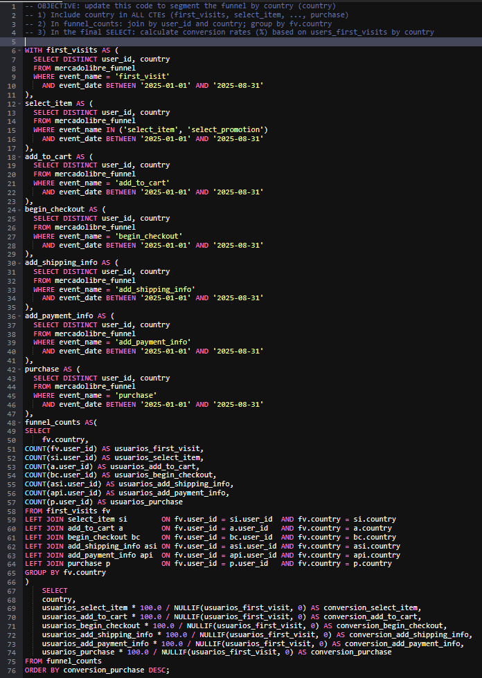
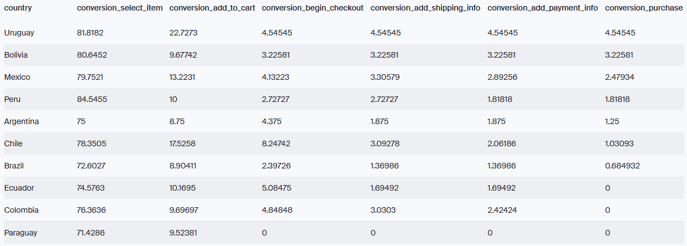
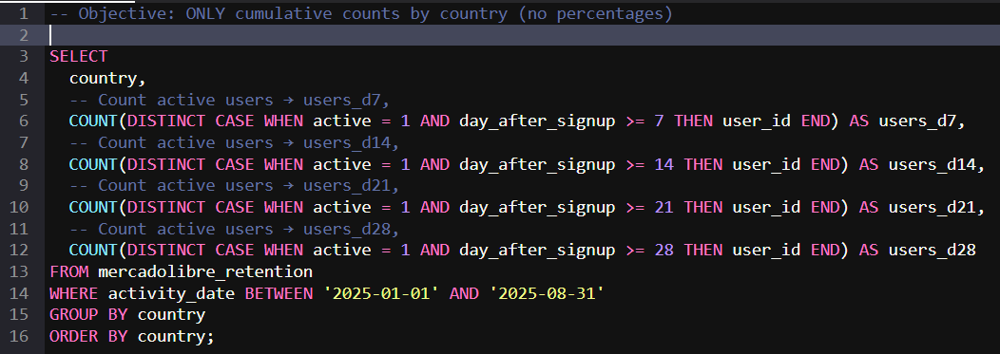
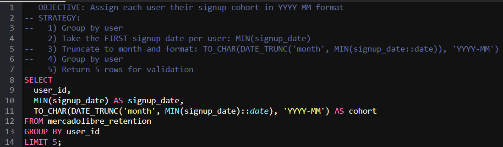
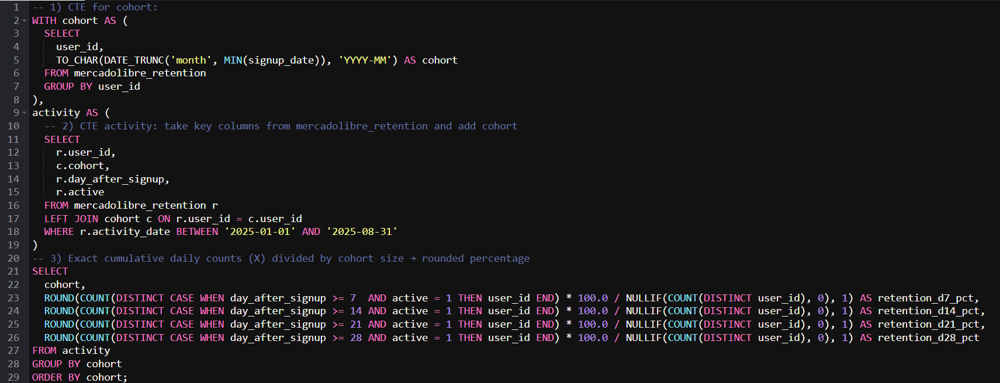
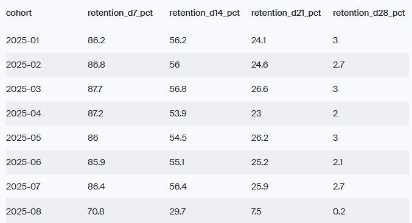

# E-commerce Funnel Retention Analysis With SQL
Within the Growth and Retention team of an E-commerce platform, the Product Director stated: “We need to understand at which stage of the process we lose users and how we can improve their retention over time.”  SQL was used to map the full conversion funnel, identify the main drop-off points, evaluate user retention by cohorts, and propose actionable improvements based on the data.

This project focuses on analyzing the full user funnel and retention performance using SQL. It aims to identify where users drop off, calculate conversion rates between key stages, and evaluate retention by cohorts over time (D7, D14, D21, D28). The analysis also examines how conversion and retention vary by country, device category, and referral source, and supports data-driven recommendations through validated results and executive-level insights.

### Project Objectives
* Build multi-stage funnels in SQL using CTEs.
* Calculate conversion rates between steps and detect drop-offs.
* Analyze user retention by cohorts.
* Simulate improvements in conversion or retention.
* Validate results and communicate executive-level findings.

### Create CTEs by stage
Objective:
* Build unique user blocks by event (CTEs) within the 2025-01-01 → 2025-08-31 date range, join them, and count users at each stage of the funnel.
* By joining them, we ensure that all users have passed through each stage of the funnel.

  

 

### Segment the Overall Funnel by Country
Objective:
Group funnel conversions by country and identify the stage of the funnel where the most users are lost.

  

 

  

 

### Count Cumulative Active Users by Country (D7, D14, D21, D28)
Objective: For each country, count cumulative active users since their registration, within the 2025-01-01 → 2025-08-31 range, on day 7, day 14, day 21, and day 28.

  

 

### Define the Signup Cohort
Objective: Analyze retention by cohort. Create an SQL query that assigns a cohort in YYYY-MM format to each user (using their first signup date).

  

 

### Calculate Retention by Cohort and Period (D7, D14, D21, D28)
Objective: For each monthly cohort (YYYY-MM), calculate the percentage of active users on day 7, 14, 21, and 28 since their signup.

  

 

  

 

## Executive Report: User Conversion & Retention Analysis
**1. Context**
An analysis of the user lifecycle (end-to-end funnel and retention) was conducted to identify friction points and evaluate user loyalty.
- Period: January 1, 2025 – August 31, 2025.
- Scope: Funnel conversion metrics and retention rates (analyzed by general view, country, and monthly cohorts).

**2. Key Findings**
* **Conversion Funnel:**
* - Global Performance: While 76.9% of users show interest (select_item), only 1.25% complete a purchase.
* - Major Bottleneck: The most significant drop-off occurs between Item Selection and Add to Cart, with an 85.7% loss. This suggests barriers related to pricing, stock availability, or Product Detail Page (PDP) UX.
* - Country Performance:
* - - Top Performer: Uruguay (4.55% conversion).
* - - Critical Failure: Ecuador, Colombia, and Paraguay show 0.00% sales despite traffic reaching checkout (~5%), indicating a severe technical error (payment gateway or logistics).
* - - Anomaly: Chile has the highest "Add to Cart" rate (17.53%) but a low final conversion (1.03%), suggesting friction at the checkout stage.

* **Retention (Loyalty):**
* - Cohort Behavior: Early retention is strong (D7 ~87%, D14 ~55%). However, there is a massive "Day 28 Cliff," where retention plummets from ~25% (D21) to just 2-3% (D28).
* - Country Behavior: Brazil has the highest retention (users love to browse/window shop) but very low conversion. Mexico displays the healthiest balance between high retention and decent conversion.

**3. Strategic Recommendations**
* Urgent Technical Fix (High Priority): Immediately investigate payment and shipping configurations in Colombia, Ecuador, and Paraguay to resolve the 0% conversion blocking bug.
* Product Page Optimization: Conduct A/B testing on the "Add to Cart" flow and improve shipping cost visibility to reduce the 85% drop-off at the selection stage.
* Reactivation Strategy: Implement automated CRM campaigns (Email/Push) around Day 20 with incentives to prevent the drastic churn observed at Day 28.
* Regional Tactics:
* - Chile: Review checkout costs and payment methods to capitalize on high cart intent.
* - Brazil: Deploy "first-purchase" incentives to convert high-retention browsers into buyers.
